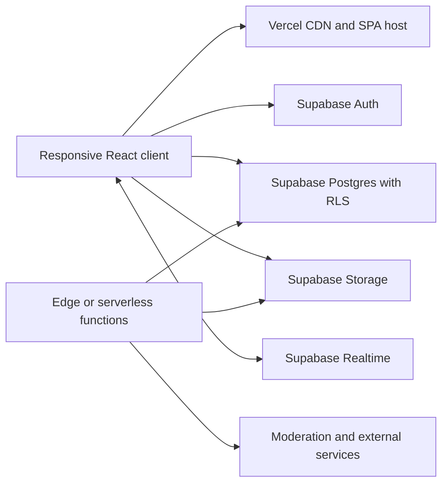

# Target Architecture

Status: approved direction; Supabase integration is the production target and may follow the first responsive UI checkpoint.

## Architecture principles

1. Build one responsive React application with Vite and deploy its production bundle to Vercel.
2. Treat Supabase Row Level Security and database constraints as the final authorization boundary.
3. Render user text as text. Never use `dangerouslySetInnerHTML` for listings, profiles, services, messages, or reviews.
4. Keep marketplace inventory and services as separate top-level domains. The marketplace query and cards must never include service records.
5. Keep contact information private; negotiation happens through participant-scoped offers and chat.
6. Use stable IDs, integer minor currency units, explicit lifecycle states, and versioned migrations.
7. Separate public, authenticated, privileged, and private data paths.

Vercel serves the application. The browser uses the Supabase publishable credential and the signed-in user's session. Privileged work that must bypass ordinary user policies belongs in a narrowly scoped Edge Function or serverless function with server-only credentials.

## Technology baseline

- React and Vite
- React Router for route ownership and deep links
- TypeScript before production data integration
- Supabase JS client with PKCE-based Auth
- Generated Supabase database types
- A schema-validation library shared by forms and mutations
- TanStack Query, or an equivalent centralized remote-data cache, when live data is connected
- CSS design tokens and accessible headless primitives; avoid page-specific style forks
- Vitest, React Testing Library, Playwright, and automated accessibility checks

## Route and screen map

| Route | Screen responsibility |
| --- | --- |
| `/` | Public Venturr value proposition with Supabase sign-in/sign-up |
| `/explore` | Public, data-free product tour; all real campus records remain locked |
| `/auth/callback` | Supabase PKCE/email-confirmation callback |
| `/onboarding` | Authenticated college-domain detection, membership request, and profile completion |
| `/marketplace` | Item-only browse, search, filters, sort, and saved-search entry |
| `/marketplace/:listingId` | Item detail, gallery, seller trust, offer, and handoff context |
| `/services` | Separate service-provider discovery and service categories |
| `/services/:serviceId` | Service detail, availability, booking/request, and provider trust |
| `/post` | Choose sale, rent, free, wanted, or service; route to the correct composer |
| `/sell` | Create an item listing |
| `/listings/:listingId/edit` | Owner-only edit and lifecycle management |
| `/saved` | Favorite item listings; no cart quantities |
| `/inbox` | Conversation list |
| `/inbox/:conversationId` | Participant-only offer and message thread |
| `/profile/:profileId` | Public-safe profile, trust signals, and active inventory |
| `/profile` | Private owner profile, campus membership state, and profile editing |
| `/account/listings` | Owner inventory, drafts, reserved, completed, and archived states |
| `/safety`, `/privacy`, `/terms` | Required trust, privacy, and policy content |

Desktop navigation exposes Marketplace and Services as sibling tabs. Mobile navigation keeps both discoverable without merging their feeds. `ServiceCard` must never be rendered by `MarketplacePage`, and marketplace queries must explicitly filter item transaction types.

## Frontend boundaries

### Application shell

- `AppShell`: skip link, desktop header, mobile navigation, main landmark, toast/status region.
- `AppRouter`: lazy route boundaries, protected routes, not-found screen.
- `AuthProvider`: session lifecycle plus owner-scoped profile/membership loading;
  authorization remains in RLS and derived RPCs.
- `ErrorBoundary`: safe recovery UI and redacted error reporting.
- `CampusContext`: selected and verified campus, derived from server data rather than arbitrary client input.

### Marketplace

- `MarketplacePage`
- `MarketplaceSearch`
- `MarketplaceFilters`
- `ListingGrid`
- `ListingCard`
- `ListingDetailPage`
- `ListingGallery`
- `OfferComposer`
- `SellerTrustSummary`
- `PickupZoneSummary`
- `ListingComposer`

Marketplace components accept item records only. Services have their own `ServicesPage`, `ServiceCard`, `ServiceDetailPage`, provider availability, and booking/request components.

### Shared product surfaces

- `InboxPage`, `ConversationThread`, `MessageComposer`
- `SavedPage`
- `ProfilePage`, `AccountPage`
- `ReportDialog`, `BlockDialog`, `SafetyNotice`
- UI primitives for buttons, fields, dialogs, sheets, menus, tabs, badges, skeletons, empty states, and errors

Presentation components do not call Supabase directly. Route/query modules call a small data layer such as `data/listings`, `data/services`, `data/messages`, and `data/profiles`.

## Data model boundaries

Expected public-domain tables:

- `campuses`
- `campus_memberships`
- `profiles` containing public-safe fields only
- `listings`
- `listing_images`
- `favorites`
- `conversations`
- `messages`
- `offers` or `reservations`
- `services`
- `service_availability`
- `service_requests`
- `reports`
- `blocks`

Private verification, moderation evidence, and privileged audit records belong in a non-exposed schema or protected tables with no ordinary client grants.

Item listings use explicit transaction types such as `sale`, `rent`, `free`, and `wanted`. Services are stored and queried separately. Money is stored as integer minor units plus an ISO currency code. Lifecycle values are controlled states such as `draft`, `active`, `reserved`, `completed`, `expired`, `removed`, and `archived`.

## Data flow

### Signed-in campus browse

1. The route parses and normalizes URL search parameters.
2. The query layer requests active, unexpired item listings for the permitted campus.
3. Postgres grants and RLS restrict visible rows.
4. Product records are not granted to `anon`; `/explore` uses static product copy only.
5. The query cache stores only public-safe projections.
6. Search/filter state remains shareable in the URL.

The Services route runs a distinct services query. It does not reuse an unfiltered listings feed.

### Authenticated mutation

1. A form validates input in the client for fast feedback.
2. The data layer submits the mutation with the user's Supabase session.
3. Postgres constraints and RLS validate owner, campus, status, lengths, and allowed transitions again.
4. The affected query keys are invalidated.
5. Realtime updates participant views where appropriate.

Client validation is never authoritative. Owner IDs, campus IDs, moderation state, prices used in protected transactions, and lifecycle transitions cannot be trusted from browser state.

### Images

1. Restrict count, declared MIME type, byte size, and dimensions before upload.
2. Prefer JPEG, PNG, and WebP; reject SVG and animated formats initially.
3. Upload to an owner/listing-scoped random path with `upsert: false`.
4. Strip metadata and re-encode through a trusted processing function before publication.
5. Store object paths, dimensions, ordering, and moderation state in `listing_images`.
6. Use short-lived signed URLs for private/draft media or a deliberately public derivative for active listings.

### Messaging and realtime

Only conversation participants can select or insert messages. Subscribe to a single authorized conversation, not a campus-wide messages channel. Realtime updates are a delivery optimization; persisted Postgres rows are the source of truth.

## Authentication and authorization

- Prefer institution Google/Microsoft identity where available, with email OTP/magic link fallback.
- Keep Google OAuth code behind `VITE_GOOGLE_AUTH_ENABLED=false` until the
  provider, consent screen, callbacks, and production smoke tests are complete.
- Campus affiliation is a protected membership record, not a client-supplied domain or editable user metadata value.
- `claim_campus_from_verified_email()` resolves only the current confirmed Auth
  email against protected active domain records. The browser never downloads
  the domain allowlist.
- Unmatched domains may create a pending `college_id_review` membership, but
  the browser does not collect an identity document until a trusted private
  verification processor is implemented.
- Do not assume every institution uses `.edu`; support configured domains and privacy-minimized fallback verification.
- RLS is enabled on every exposed table and Storage bucket.
- Owners can mutate only their records and only through valid state transitions.
- Conversation participants alone can read/send messages and offers.
- Reviews require a confirmed completed exchange.
- Reports, moderator notes, verification evidence, and audit logs are not publicly readable.
- Service-role or secret credentials are never included in a Vite variable or browser bundle.

The browser may receive only:

- `VITE_SUPABASE_URL`
- `VITE_SUPABASE_PUBLISHABLE_KEY`
- `VITE_GOOGLE_AUTH_ENABLED` (public feature gate; not an authorization control)

These identify the project but do not replace RLS.

## Environment strategy

Use separate Supabase projects for local/development, Vercel previews, and production. A preview deployment must not write to production data.

- Commit `.env.example` with names and descriptions, never values.
- Keep `.env.local` and environment-specific secret files ignored.
- Configure Vercel Development, Preview, and Production variables independently.
- Allowlist exact production and preview auth callback URLs; avoid a broad redirect wildcard.
- Keep privileged credentials only in the serverless/Edge environment.
- Generate database types from the matching environment schema.
- Apply migrations through CI or a controlled release step, not manual dashboard drift.

Vite variables are compiled into the client bundle. Any value prefixed with `VITE_` must be considered public.

## Caching

- Vercel serves hashed JS/CSS/image assets with long-lived immutable caching.
- Serve `index.html` with revalidation so a new deployment is discovered promptly.
- Configure a Vercel SPA rewrite so deep links resolve to `index.html`.
- Cache public-safe marketplace and service queries briefly in memory; invalidate on create, edit, reserve, complete, or moderation changes.
- Do not persist messages, verification data, reports, or private profiles in a shared cache.
- Do not put tokens, emails, message text, or contact details in URLs.
- If offline/PWA support is added, cache only the application shell and public-safe content. Exclude Auth, Inbox, Account, and mutation responses.

## Security controls

- Add a restrictive Content Security Policy for the app, Supabase HTTPS/WebSocket endpoints, and explicitly approved integrations.
- Add `X-Content-Type-Options`, `Referrer-Policy`, `Permissions-Policy`, frame protection, and appropriate cross-origin headers.
- Keep production source maps private or disabled.
- Validate and rate-limit Auth, listing creation, uploads, offers, messages, and reports.
- Combine account-level quotas with IP/bot protection; campus NAT makes IP-only policy unreliable.
- Add report, block, expiry, moderation, suspension, and prohibited-items workflows before public launch.
- Redact tokens, cookies, email, contact details, message bodies, and uploaded verification material from logs.
- Test negative cross-user and cross-campus access, not only successful requests.

## Accessibility baseline

Target WCAG 2.2 AA:

- Semantic landmarks and a skip link
- Logical heading order and descriptive page titles
- Full keyboard operation and visible focus
- Focus trapping/restoration for dialogs and sheets
- Minimum 44px touch targets for primary mobile actions
- Text contrast of at least 4.5:1 and non-text contrast of at least 3:1
- Persistent labels, instructions, inline errors, and error summaries
- Status announcements that are concise and not attached to an entire changing grid
- Reduced-motion support and no interaction that depends on animation
- Responsive reflow at 320 CSS pixels and usable 200% zoom
- Meaningful image alternatives and decorative-image suppression

Automated checks are gates, not proof of compliance. Complete manual keyboard, screen-reader, zoom, and mobile checks for every release candidate.

## Testing strategy

- Unit: validation, formatting, query normalization, lifecycle rules.
- Component: forms, filters, cards, dialogs, empty/error/loading states.
- Integration: data modules against a local Supabase instance or deterministic API mocks.
- Database: migration checks, constraints, and RLS tests for anonymous, user A, user B, cross-campus user, owner, participant, and moderator.
- End to end: Auth, browse, post, upload, offer, message, reserve/complete, report, block, and account deletion.
- Security regressions: stored XSS, IDOR, forged ownership/campus/status, upload spoofing, and unauthorized Realtime subscription.
- Accessibility: axe automation plus documented manual checks.
- Release: lint, typecheck, unit/integration tests, production build, bundle review, and smoke tests.

## Observability and operations

- Client error reporting through an error boundary and a redacting provider such as Sentry.
- Vercel Web Analytics/Speed Insights or a privacy-compatible equivalent for performance.
- Supabase database, Auth, Storage, and Realtime logs with alerts on elevated failures.
- Product health metrics by campus: active inventory, time to first offer/message, completion, expiry, no-show, report, and block rates.
- Append-only audit events for privileged moderation actions.
- Tested backups, restore procedure, deployment rollback, and an incident-response owner.

Do not record private message content or contact information in analytics.

## Deployment checklist

### Before preview

- [ ] Lockfile committed; lint, typecheck, tests, and production build pass
- [ ] Preview uses its own Supabase project and publishable credential
- [ ] Migrations and generated types match the preview schema
- [ ] SPA rewrite and route refreshes work
- [ ] Auth callback URLs are exact and tested
- [ ] RLS and Storage negative tests pass
- [ ] Security headers and CSP are enabled in report-only or enforcement mode as planned
- [ ] Source maps and logs do not expose sensitive data

### Before production

- [ ] Brand, launch campuses, transaction types, currency, and policy content are approved
- [ ] Marketplace contains no service cards; Services is a separate top-level tab
- [ ] No fake verification, seller counts, ratings, orders, payment protection, or escrow claims
- [ ] Upload limits, image processing, reports, blocks, moderation, and rate limits are active
- [ ] Accessibility and responsive manual QA is complete
- [ ] Performance budgets and Core Web Vitals checks pass
- [ ] Production Supabase migrations, backups, and restore procedure are verified
- [ ] Vercel production variables, custom domain, HTTPS, and rollback are verified
- [ ] Privacy, terms, safety, retention, export, and deletion flows are published
- [ ] Monitoring and incident alerts have named owners

### After deployment

- [ ] Run a production smoke test without using privileged credentials
- [ ] Verify Auth, listing visibility, image access, messaging, and RLS across two real test users
- [ ] Confirm analytics/log redaction
- [ ] Monitor errors, abuse signals, database health, and performance
- [ ] Record the released migration and deployment identifiers
